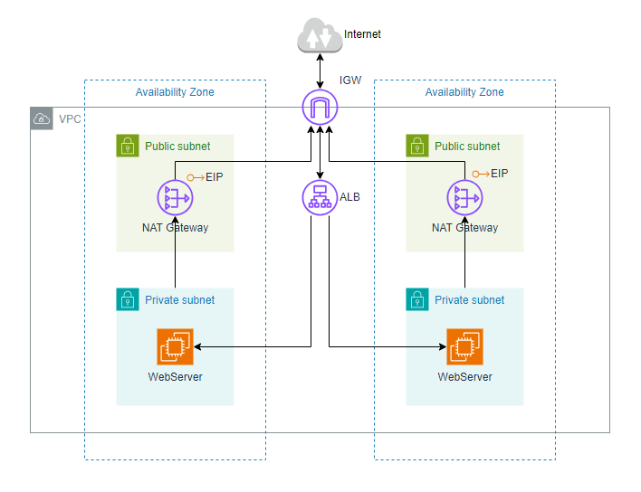

Static HTML Web App Deployment on AWS
This project demonstrates hosting a static HTML web application on AWS using EC2 instances and a variety of AWS services to achieve scalability, high availability, and fault tolerance.

Project Description
The project uses AWS resources, including VPC, EC2 Instances, Application Load Balancer, and Auto Scaling Groups, to host and manage a static web application. The deployment script and architecture ensure a secure, highly available, and scalable web solution.

Architecture and AWS Resources
VPC: Configured with public and private subnets across 2 Availability Zones (AZs).
Internet Gateway: Allows communication between the VPC and the Internet.
Security Groups: Act as a firewall to secure and control inbound and outbound traffic to instances.
Availability Zones: Two AZs are used to ensure high availability and fault tolerance.
Public Subnets: Resources such as NAT Gateway, Bastion Host, and Application Load Balancer are deployed in public subnets.
EC2 Instance Connect Endpoint: Enables access to resources in both public and private subnets.
Private Subnets:
Web servers and database servers are placed in private subnets to enhance security.
NAT Gateway allows private subnets (App and Data) to access the Internet securely.
EC2 Instances: Used to host the static web application.
Application Load Balancer (ALB): Distributes incoming web traffic across multiple EC2 instances in an Auto Scaling Group to ensure load balancing and redundancy.
Auto Scaling Group (ASG): Dynamically creates and manages EC2 instances to maintain a highly available, scalable, and fault-tolerant environment.
GitHub: Used to store the website files.
AMI: After deploying the web app, the EC2 instance is used to create an Amazon Machine Image (AMI) for reusability and rapid instance creation.
Deployment Script
The following bash script automates the deployment of the static web application on an EC2 instance:

bash
Copy code
#!/bin/bash
# Switch to root user
sudo su

# Update system packages
yum update -y

# Install Apache HTTP Server
yum install -y httpd

# Move to the web directory
cd /var/www/html

# Download the web application files
wget https://www.free-css.com/assets/files/free-css-templates/download/page296/neogym.zip

# Unzip the downloaded files
unzip neogym.zip

# Copy the extracted files to the web root directory
cp -r /var/www/html/neogym/* /var/www/html

# Remove unnecessary files
rm -rf neogym.zip neogym

# Enable and start the Apache service
systemctl enable httpd
systemctl start httpd
Steps to Deploy the Web App
Launch an EC2 Instance:

Choose Amazon Linux 2 as the AMI.
Attach the required Security Groups for HTTP access (port 80).
SSH into the Instance:
Use the key pair to connect to the instance.

Run the Script:
Copy and execute the provided bash script on the EC2 instance.

Verify the Deployment:
Open the public IP of the EC2 instance in a web browser. The static website should load successfully.

High Availability and Scalability
Application Load Balancer distributes traffic to multiple EC2 instances.
Auto Scaling Group ensures new EC2 instances are created dynamically to handle increased traffic and maintain fault tolerance across 2 Availability Zones.

Repository
The reference architecture diagram and deployment scripts are stored in the project’s GitHub repository.

